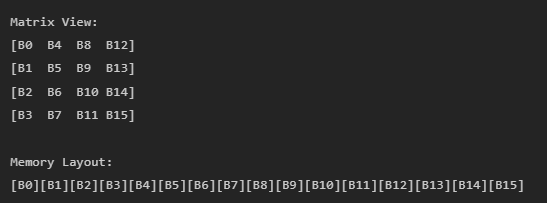
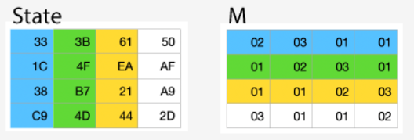
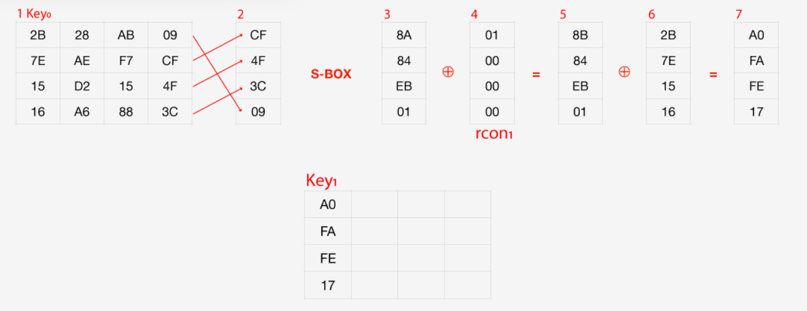
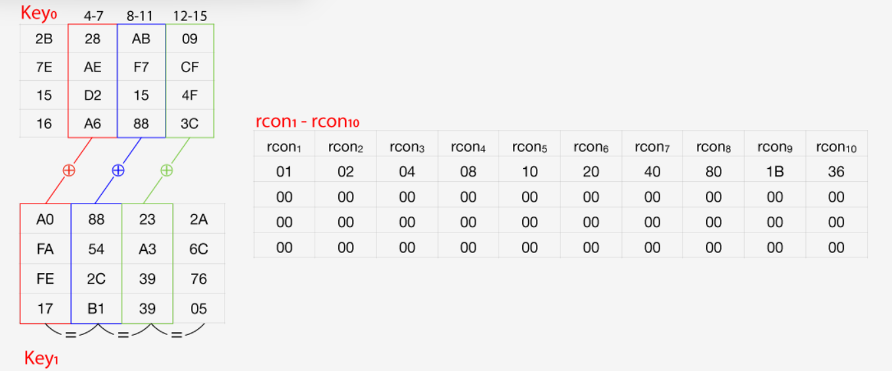

# Manual Técnico

Este proyecto implementa el algoritmo de cifrado AES-128 (Advanced Encryption Standard) en lenguaje ensamblador ARM64. La implementación incluye todas las operaciones fundamentales de AES y permite cifrar texto de hasta 16 caracteres utilizando una clave de 128 bits. Para ello se muestra un resumen de las caracterisícas del mismo:

- **Arquitectura**: ARM64 (AArch64)
- **Syscalls**: Linux (write=64, read=63, exit=93)
- **Organización de memoria**: Column-major para matrices 4x4
- **Registros preservados**: x19-x30 según convención ARM64
- **Formato de salida**: Hexadecimal sin prefijo 0x
- **Virtualización**: Para la virtualización y ejecución se utiliza QEMU.

## Estructura del Proyecto

El proyecto está organizado en módulos que separan las diferentes funcionalidades del sistema:

- **bss.s**: Acá se declaran las variables globales no inicializadas
- **constants.s**: Variables que no cambian, como las tablas de consulta (S-box, Rcon)
- **data.s**: Cadenas de texto y mensajes
- **macros.s**: Macros para syscalls
- **io_utils.s**: Funciones de entrada/salida
- **functions.s**: Operaciones principales de AES
- **debug_utils.s**: Funciones de depuración, para mostrar en consola
- **main.s**: Punto de entrada y flujo principal

## Componentes Principales

### Variables Globales (bss.s)

Siguiendo las directrices de ARM64, se utiliza la sección `bss` para inicializar las varibales que no se conoce el valor que tomarán, únicamente se reserva el espacio de memoria.

```assembly
.section .bss

.global matState
matState: .space 16, 0      // Matriz de estado 4x4

.global key
key: .space 16, 0           // Clave original de 128 bits

.global criptograma
criptograma: .space 16, 0   // Resultado final

// Buffer utilizado para almacenar la entrada del usuario
.global buffer
buffer: .space 256, 0 

// Almacena las 10 calves generadas
.global expandedKeys
expandedKeys: .space 176, 0

.global tempWord
tempWord: .space 4, 0
    
.global roundKey
roundKey: .space 16, 0
```

### Constantes (constants.s)

Ubicada en el área de memoria `.rodata`, acá se contienen las variables cuyo valor no cambia, es decir las tablas estáticas necesarias para AES (SBox y Rcon):

```assembly
.section .rodata
.global Sbox
Sbox:
    .byte 0x63, 0x7c, 0x77, 0x7b, 0xf2, 0x6b, 0x6f, 0xc5, 0x30, 0x01, 0x67, 0x2b, 0xfe, 0xd7, 0xab, 0x76
    .byte 0xca, 0x82, 0xc9, 0x7d, 0xfa, 0x59, 0x47, 0xf0, 0xad, 0xd4, 0xa2, 0xaf, 0x9c, 0xa4, 0x72, 0xc0
    .byte 0xb7, 0xfd, 0x93, 0x26, 0x36, 0x3f, 0xf7, 0xcc, 0x34, 0xa5, 0xe5, 0xf1, 0x71, 0xd8, 0x31, 0x15
    .byte 0x04, 0xc7, 0x23, 0xc3, 0x18, 0x96, 0x05, 0x9a, 0x07, 0x12, 0x80, 0xe2, 0xeb, 0x27, 0xb2, 0x75
    .byte 0x09, 0x83, 0x2c, 0x1a, 0x1b, 0x6e, 0x5a, 0xa0, 0x52, 0x3b, 0xd6, 0xb3, 0x29, 0xe3, 0x2f, 0x84
    .byte 0x53, 0xd1, 0x00, 0xed, 0x20, 0xfc, 0xb1, 0x5b, 0x6a, 0xcb, 0xbe, 0x39, 0x4a, 0x4c, 0x58, 0xcf
    .byte 0xd0, 0xef, 0xaa, 0xfb, 0x43, 0x4d, 0x33, 0x85, 0x45, 0xf9, 0x02, 0x7f, 0x50, 0x3c, 0x9f, 0xa8
    .byte 0x51, 0xa3, 0x40, 0x8f, 0x92, 0x9d, 0x38, 0xf5, 0xbc, 0xb6, 0xda, 0x21, 0x10, 0xff, 0xf3, 0xd2
    .byte 0xcd, 0x0c, 0x13, 0xec, 0x5f, 0x97, 0x44, 0x17, 0xc4, 0xa7, 0x7e, 0x3d, 0x64, 0x5d, 0x19, 0x73
    .byte 0x60, 0x81, 0x4f, 0xdc, 0x22, 0x2a, 0x90, 0x88, 0x46, 0xee, 0xb8, 0x14, 0xde, 0x5e, 0x0b, 0xdb
    .byte 0xe0, 0x32, 0x3a, 0x0a, 0x49, 0x06, 0x24, 0x5c, 0xc2, 0xd3, 0xac, 0x62, 0x91, 0x95, 0xe4, 0x79
    .byte 0xe7, 0xc8, 0x37, 0x6d, 0x8d, 0xd5, 0x4e, 0xa9, 0x6c, 0x56, 0xf4, 0xea, 0x65, 0x7a, 0xae, 0x08
    .byte 0xba, 0x78, 0x25, 0x2e, 0x1c, 0xa6, 0xb4, 0xc6, 0xe8, 0xdd, 0x74, 0x1f, 0x4b, 0xbd, 0x8b, 0x8a
    .byte 0x70, 0x3e, 0xb5, 0x66, 0x48, 0x03, 0xf6, 0x0e, 0x61, 0x35, 0x57, 0xb9, 0x86, 0xc1, 0x1d, 0x9e
    .byte 0xe1, 0xf8, 0x98, 0x11, 0x69, 0xd9, 0x8e, 0x94, 0x9b, 0x1e, 0x87, 0xe9, 0xce, 0x55, 0x28, 0xdf
    .byte 0x8c, 0xa1, 0x89, 0x0d, 0xbf, 0xe6, 0x42, 0x68, 0x41, 0x99, 0x2d, 0x0f, 0xb0, 0x54, 0xbb, 0x16

.global Rcon
Rcon:   
    .byte 0x01, 0x00, 0x00, 0x00
    .byte 0x02, 0x00, 0x00, 0x00
    .byte 0x04, 0x00, 0x00, 0x00
    .byte 0x08, 0x00, 0x00, 0x00
    .byte 0x10, 0x00, 0x00, 0x00
    .byte 0x20, 0x00, 0x00, 0x00
    .byte 0x40, 0x00, 0x00, 0x00
    .byte 0x80, 0x00, 0x00, 0x00
    .byte 0x1B, 0x00, 0x00, 0x00
    .byte 0x36, 0x00, 0x00, 0x00
```

### Macros de Sistema (macros.s)

Acá se utilizan macros (bloque de código o una secuencia de instrucciones, para luego ser reutilizado múltiples veces dentro del programa). Esto simplifica las llamadas al sistema, haciendo que únicamente se llame a la función print y read para mostrar en pantalla algo o pedir al usuario ingresar algo al sistema:

```assembly
.macro print fd, buffer, len
    mov x0, \fd
    ldr x1, =\buffer
    mov x2, \len
    mov x8, #64     // sys_write
    svc #0
.endm

.macro read fd, buffer, len
    mov x0, \fd
    ldr x1, =\buffer
    mov x2, \len
    mov x8, #63     // sys_read
    svc #0
.endm
```

## Operaciones del algoritmo AES

### SubBytes

Sustituye cada byte de la matiz estado, usando la S-box. Para ello primero se asegura que la función tenga la etiqueta `.global`, para que se accesible desde cualquier parte del programa.

```assembly
.type subBytes, %function
.global subBytes
subBytes:
```

Luego, ya dentro de la función se almancenan los valores del FramePointer y del LinkRegister, esto es una práctica obligatoria al trabajar con funciones, se realiza para poder seguir con un flujo correcto de la aplicación a lo largo del programa.
Además almacenamos en la pila, el valor de los registros x19 y x20 (la matriz de estado y la SBox)

```assembly
    stp x29, x30, [sp, #-32]! 
    mov x29, sp 
    
    str x19, [sp, #16] 
    str x20, [sp, #24] 
    
    ldr x19, =matState 
    ldr x20, =Sbox 
    
    mov x0, #0 
```

Luego se realiza el proceso de sustituir los bytes, esto se logra con un loop, el cual itera en el registro x0, lo compara con 16 (tamaño de la matrix de 4x4). Al hacer las 16 iteraciones hace un salto a la parte de la función donde se define que hacer al finalizar SubBytes.

```assembly
subbytes_loop:
    cmp x0, #16
    b.ge subbytes_done
    
    ldrb w1, [x19, x0] 
    
    uxtw x1, w1 
    
    ldrb w2, [x20, x1] 
    
    strb w2, [x19, x0] 
    
    add x0, x0, #1
    b subbytes_loop
```

Al finalizar el loop, se realiza la restauración de los registros `x29` y `x30`, la práctica común al salir de una función. Se utiliza la función `ret` para retornar de la función a el lugar de donde se llamó.

```assembly
    subbytes_done:
    ldr x19, [sp, #16]
    ldr x20, [sp, #24]
    
    ldp x29, x30, [sp], #32
    ret
    .size subBytes, (. - subBytes)
```

### ShiftRows

Desplaza cíclicamente las filas de la matriz de estado. Para ello primero se asegura que la función tenga la etiqueta `.global`, para que se accesible desde cualquier parte del programa.

```assembly
.type shiftRows, %function
.global shiftRows
shiftRows:
```

Luego se almacenanan el registro `x29` y `x30`, además de otros registros necesarios para manejar de manera correcta el mixColumns, además de cargar la matriz para poder trabajar con ella en el registro `x19`, el que será habitual para esta tarea.

```assembly
    stp x29, x30, [sp, #-48]!
    mov x29, sp
    str x19, [sp, #16]
    str x20, [sp, #24]
    str x21, [sp, #32]
    str x22, [sp, #40]
    ldr x19, =matState
```

Luego, se realiza la parte principal de ShiftRows, la cual se explica de mejor manera en la tabla

| Bloque | Ubicación de memoria | Operación Realizada | Resultado (Permutación) |
| :--- | :--- | :--- | :--- |
| **1** | B4 a B7 | **Rotación a la izquierda** de 1 byte. | $(\text{B4}, \text{B5}, \text{B6}, \text{B7}) \longrightarrow (\mathbf{\text{B5}}, \mathbf{\text{B6}}, \mathbf{\text{B7}}, \mathbf{\text{B4}})$ |
| **2** | B8 a B11 | **Intercambio de medias palabras** (intercambio de los primeros 2 bytes con los últimos 2 bytes). | $(\text{B8}, \text{B9}, \text{B10}, \text{B11}) \longrightarrow (\mathbf{\text{B10}}, \mathbf{\text{B11}}, \mathbf{\text{B8}}, \mathbf{\text{B9}})$ |
| **3** | B12 a B15 | **Rotación a la derecha** de 1 byte. | $(\text{B12}, \text{B13}, \text{B14}, \text{B15}) \longrightarrow (\mathbf{\text{B15}}, \mathbf{\text{B12}}, \mathbf{\text{B13}}, \mathbf{\text{B14}})$ |

Es importante explicar que para este paso del algoritmo se inicia en la posición de memoria B4, pues de B0 a B3 no se tocan en esta parte del algoritmo. Para una mejor visualización de este concepto, se puede ver en la siguiente imagen.



```assembly
    ldrb w20, [x19, #4]
    ldrb w21, [x19, #5]
    strb w21, [x19, #4]
    ldrb w21, [x19, #6]
    strb w21, [x19, #5]
    ldrb w21, [x19, #7]
    strb w21, [x19, #6]
    strb w20, [x19, #7]
    ldrb w20, [x19, #8]
    ldrb w21, [x19, #9]
    ldrb w22, [x19, #10]
    strb w22, [x19, #8]
    ldrb w22, [x19, #11]
    strb w22, [x19, #9]
    strb w20, [x19, #10]
    strb w21, [x19, #11]
    ldrb w20, [x19, #12]
    ldrb w21, [x19, #15]
    strb w21, [x19, #12]
    ldrb w21, [x19, #14]
    strb w21, [x19, #15]
    ldrb w21, [x19, #13]
    strb w21, [x19, #14]
    strb w20, [x19, #13]
```

Al final se restauran los registros correspondientes

```assembly
    ldr x19, [sp, #16]
    ldr x20, [sp, #24]
    ldr x21, [sp, #32]
    ldr x22, [sp, #40]
    ldp x29, x30, [sp], #48
    ret
    .size shiftRows, (. - shiftRows)
```

### MixColumns

Mezcla las columnas usando multiplicación en el campo de Galois. Para ello primero se asegura que la función tenga la etiqueta `.global`, para que se accesible desde cualquier parte del programa.

```assembly
.type mixColumns, %function
.global mixColumns
mixColumns:
```

Luego se almacenan y cargan los registros correspondientes para manejar el mixcolumns

```assembly
    stp x29, x30, [sp, #-80]!
    mov x29, sp
    str x19, [sp, #16]
    str x20, [sp, #24]
    str x21, [sp, #32]
    str x22, [sp, #40]
    str x23, [sp, #48]
    str x24, [sp, #56]
    str x25, [sp, #64]
    str x26, [sp, #72]
    ldr x19, =matState
    mov x20, #0
```

Posterior a esto realiza las operaciones del campo de galois, esto es una multiplicación por 2 y por 3, luego aplicar operaciones XoR, para esto se utiliza la tabla preestablecida dada por:



Se dará la implementación de una de las partes de este algoritmo:

```assembly
    mixcol_row_loop:
    cmp x20, #4
    b.ge mixcol_done
    ldrb w22, [x19, x20]
    add x0, x20, #4
    ldrb w23, [x19, x0]
    add x0, x20, #8
    ldrb w24, [x19, x0]
    add x0, x20, #12
    ldrb w25, [x19, x0]
    mov w0, w22
    bl galois_mul2
    mov w26, w0
    mov w0, w23
    bl galois_mul3
    eor w26, w26, w0
    eor w26, w26, w24
    eor w26, w26, w25
```

Como se observa utiliza 2 funciones auxiliares, `galois_mul2` y `galois_mul3`, estas se definen de la manera siguiente y realizan la multiplicación por 2 y por 3, respectivamente:

```assembly
.type galois_mul2, %function
galois_mul2:
    and w1, w0, #0x80
    lsl w0, w0, #1
    and w0, w0, #0xFF
    cmp w1, #0x80
    b.ne galois_mul2_done
    mov w2, #0x1B
    eor w0, w0, w2
galois_mul2_done:
    ret
    .size galois_mul2, (. - galois_mul2)

.type galois_mul3, %function
galois_mul3:
    stp x29, x30, [sp, #-32]!
    mov x29, sp
    str x19, [sp, #16]
    mov w19, w0
    bl galois_mul2
    eor w0, w0, w19
    ldr x19, [sp, #16]
    ldp x29, x30, [sp], #32
    ret
    .size galois_mul3, (. - galois_mul3)
```

### AddRoundKey

Realiza XOR entre el estado y la subclave de la ronda. Para ello primero se asegura que la función tenga la etiqueta `.global`, para que se accesible desde cualquier parte del programa.

```assembly
.type addRoundKey, %function
.global addRoundKey
addRoundKey:
```

Luego se almacenanan el registro `x29` y `x30`, además de otros registros necesarios para manejar de manera correcta el mixColumns, además de cargar la matriz para poder trabajar con ella en el registro `x19`, el que será habitual para esta tarea.

```assembly
addRoundKey:
    stp x29, x30, [sp, #-32]! 
    mov x29, sp 
    
    str x19, [sp, #16] 
    str x20, [sp, #24] 
    
    ldr x19, =matState 
    ldr x20, =key 
    
    mov x0, #0 
```

Luego de cargar los registros correspondientes, se realiza una operación XoR entre la matriz y la matriz de la clave. Esto se realiza con el código:

```assembly
addroundkey_loop:
    cmp x0, #16
    b.ge addroundkey_done
    
    ldrb w1, [x19, x0] 
    ldrb w2, [x20, x0] 
    
    eor w3, w1, w2 
    
    strb w3, [x19, x0] 
    
    add x0, x0, #1
    b addroundkey_loop
```

El código anterior va a repetir las operaciones XoR entre cada elemento hasta haberlo hecho a toda la matriz, luego realiza un salto a la parte final, que realiza un salto de retorno con el código:

```assembly
addroundkey_done:
    ldr x19, [sp, #16]
    ldr x20, [sp, #24]
    
    ldp x29, x30, [sp], #32
    ret
    .size addRoundKey, (. - addRoundKey)
```

## Expansión de Clave

Genera las 11 subclaves necesarias para las rondas. Para generar los primeros 4 bytes de la nueva clave (vea la imagen que sigue):

1. La clave original (key0 aparece en el número 1).
2. Reorganizamos los últimos 4 bytes de la clave.
3. Sustituimos cada byte usando la tabla S-BOX.
4. Hacemos un XOR con los 4 bytes de rcon1 (explicación más adelante).
5. Resultado del XOR anterior.
6. Hacemos otro XOR con los primeros 4 bytes de la clave original.
7. Finalmente, tenemos los primeros 4 bytes de la nueva clave.



Esto se realiza con el código:

```assembly
.type keyExpansion, %function
.global keyExpansion
keyExpansion:
    stp x29, x30, [sp, #-64]!
    mov x29, sp
    str x19, [sp, #16]
    str x20, [sp, #24]
    str x21, [sp, #32]
    str x22, [sp, #40]
    str x23, [sp, #48]
    str x24, [sp, #56]
    ldr x19, =key
    ldr x20, =expandedKeys
    ldr x21, =Rcon
    mov x22, #0
copy_initial_key:
    cmp x22, #16
    b.ge expansion_loop_init
    ldrb w23, [x19, x22]
    strb w23, [x20, x22]
    add x22, x22, #1
    b copy_initial_key
expansion_loop_init:
    mov x22, #4
expansion_loop:
    cmp x22, #44
    b.ge expansion_done
    sub x23, x22, #1
    mov x24, #4
    mul x23, x23, x24
    add x23, x20, x23
    ldr x0, =tempWord
    mov x1, x23
    bl copyWord
    and x26, x22, #3
    cbnz x26, not_multiple_of_n
    ldr x0, =tempWord
    bl rotByte
    ldr x0, =tempWord
    bl byteSub
    lsr x25, x22, #2
    sub x25, x25, #1
    mov x24, #4
    mul x25, x25, x24
    add x25, x21, x25
    ldr x0, =tempWord
    ldrb w1, [x0, #0]
    ldrb w2, [x25, #0]
    eor w1, w1, w2
    strb w1, [x0, #0]
```

- Bytes 4 a 15
    Las próximos bytes se generan de manera mucho más sencilla (ver imagen a continuación):

    1. Bytes 4 a 7 (2da columna): XOR entre los bytes 4 a 7 de la clave original y los 4 bytes anteriores de la nueva clave (en rojo).
    2. Bytes 8 a 11 (3ra columna): XOR entre los bytes 8 a 11 de la clave original y los 4 bytes anteriores de la nueva clave (en azul).
    3. Bytes 12 a 15 (4ta columna): XOR entre los bytes 12 a 15 de la clave original y los 4 bytes anteriores de la nueva clave (en verde).



```assembly
not_multiple_of_n:
    sub x23, x22, #4
    mov x24, #4
    mul x23, x23, x24
    add x23, x20, x23
    mov x24, #4
    mul x24, x22, x24
    add x24, x20, x24
    mov x0, x24
    mov x1, x23
    bl copyWord
    mov x0, x24
    ldr x1, =tempWord
    bl xorWords
    add x22, x22, #1
    b expansion_loop
expansion_done:
    ldr x19, [sp, #16]
    ldr x20, [sp, #24]
    ldr x21, [sp, #32]
    ldr x22, [sp, #40]
    ldr x23, [sp, #48]
    ldr x24, [sp, #56]
    ldp x29, x30, [sp], #64
    ret
    .size keyExpansion, (. - keyExpansion)
```

Esto se realiza 10 veces para tener las 10 claves necearias.

## Entrada/Salida

### Lectura de Texto

Convierte la entrada del usuario a la matriz de estado en orden column-major, utiliza la macro descrita anteriormente para pedir al usuario ingresar la frase a encriptar:

```assembly
.global readTextInput
readTextInput:
    read 0, buffer, 256
    
    ldr x1, =buffer
    ldr x2, =matState
    mov x3, #0

convert_text_loop:
    ldrb w4, [x1, x3]
    
    // Calcular índice column-major: (i%4)*4 + (i/4)
    mov x7, #4
    udiv x8, x3, x7
    msub x9, x8, x7, x3
    mul x10, x9, x7
    add x10, x10, x8
    
    strb w4, [x2, x10]

```

### Conversión de Clave Hexadecimal

Convierte la clave en formato hexadecimal a bytes:

```assembly
.global convertHexKey
convertHexKey:
    read 0, buffer, 33
    
process_hex_pair:
    ldrb w4, [x1, x11]
    bl hex_char_to_nibble
    lsl w5, w0, #4          // Nibble alto
    
    ldrb w4, [x1, x11]
    bl hex_char_to_nibble
    orr w5, w5, w0          // Combinar nibbles
    
    strb w5, [x2, x3]
```

## Flujo Principal

El programa ejecuta el algoritmo AES completo:

```assembly
_start:
    // 1. Leer texto y clave
    bl readTextInput
    bl convertHexKey
    
    // 2. Expandir claves
    bl keyExpansion
    
    // 3. Ronda inicial
    mov w0, #0
    bl addRoundKeyWithRound
    
    // 4. Rondas 1-9
    mov w19, #1
main_rounds_loop:
    cmp w19, #10
    b.ge final_round
    
    bl subBytes
    bl shiftRows
    bl mixColumns
    bl addRoundKeyWithRound
    
    add w19, w19, #1
    b main_rounds_loop
    
    // 5. Ronda final (sin MixColumns)
final_round:
    bl subBytes
    bl shiftRows
    bl addRoundKeyWithRound

```

## Compilación y Ejecución

```bash
# Compilar
aarch64-linux-gnu-as -o bss.o src/bss.s
aarch64-linux-gnu-as -o constants.o src/constants.s
aarch64-linux-gnu-as -o data.o src/data.s
aarch64-linux-gnu-as -o io_utils.o src/io_utils.s
aarch64-linux-gnu-as -o functions.o src/functions.s
aarch64-linux-gnu-as -o debug_utils.o src/debug_utils.s
aarch64-linux-gnu-as -o main.o src/main.s

# Enlazar
aarch64-linux-gnu-ld -o Main main.o functions.o io_utils.o debug_utils.o bss.o constants.o data.o 

# Ejecutar
./Main
```
