# Manual de Usuario

Para poder iniciar el programa es necesario tener una serie de herramientas, la cual dependen del sistema operativo que tenga:

## Windows

* [WSL](https://learn.microsoft.com/es-es/windows/wsl/install) (Herramienta que permite simular un entorno de linux)
* [QEMU](https://www.qemu.org/download/#windows) (Software de virtualización)

## Linux

Para caulquier distro de Linux:

* [QEMU](https://www.qemu.org/download/#linux) (Software de virtualización)

### PASOS PARA LA EJECUCIÓN

#### Paso 1

Como primer paso se debe clonar el repositorio de github en donde está el código fuente de la aplicación. Para ello se navega a la carpeta en donde se desea guardar, se abre una consola de comandos `cmd` en la ruta de la carpeta deseada y se ejecuta el comando

~~~git
git clone https://github.com/DavidPaniagua5/ACYE1-P2-2S-202004777
~~~

#### Paso 2

Una vez clonado el repositorio en la carpeta deseada, se navega a la carpeta `src`. Sigueindo en la terminal se ejecuta el comando `cd src` seguido de un enter.

#### Paso 3

Una vez en la ruta de la carpeta src, si se está en Windows, se ejecuta el comando `wsl`, para poder iniciar el entorno de Linux.

#### Paso 4

Una vez se muestre en consola la terminal de Linux, se ejecuta el comando

~~~sh
qemu-aarch64 ./Main
~~~

Con esto se desplegará el inicio de la aplicación.

#### Paso 5

Una vez iniciada la aplicación, se pedirá ingresar el texto a cifrar, este debe ser ingresado tal cual se desea cifrar, por ejemplo `Two One Nine Two`

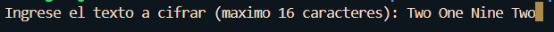
Al presionar enter se cargará en la matriz correspondiente.

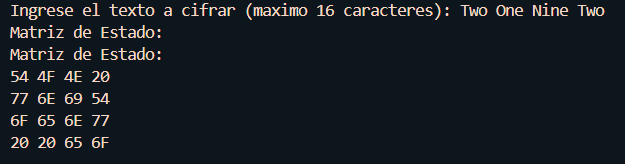

#### Paso 6

Al precionar enter, nos pedirá la clave para poder cifrar el texto, esta debe ser de 32 bits hexadecimales (32 caracteres de 0-9 y de A-F), para su generación se puede usar la siguiente [página](https://www.browserling.com/tools/random-hex) ó se puede usar la clave del ejemplo:

~~~python
5468617473206D79204B756E67204675
~~~

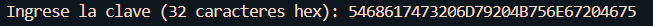

Al presionar enter se cargará en la matriz correspondiente.
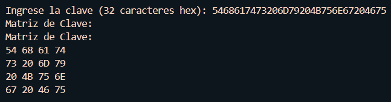

#### Paso 7

Una vez ingresada la clave, se ejecutarán las 10 rondas de una vez, las cuales son descritas en la siguiente manera:

##### Paso 8: Expansión de calves

Como primer punto, el sistema es capaz de crear las 10 claves necesarias para los diferentes pasos del algoritmo, las cuales se ejemplifican en:

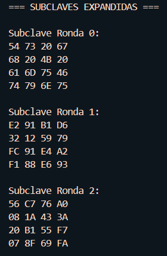

##### Paso 9: AddRoundKey

Seguido a esto, se realiza el paso del algoritmo llamado AddRounKey, en el que realiza una operacion XoR entre la cadena ingresada y la clave.

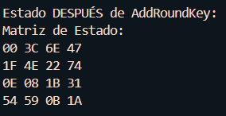

##### Paso 10: SubBytes

Luego, se realiza SubBytes, acá se realiza una sustitución de cada elemento de la matriz, por su correspondiente en la matriz llamada S-Box:

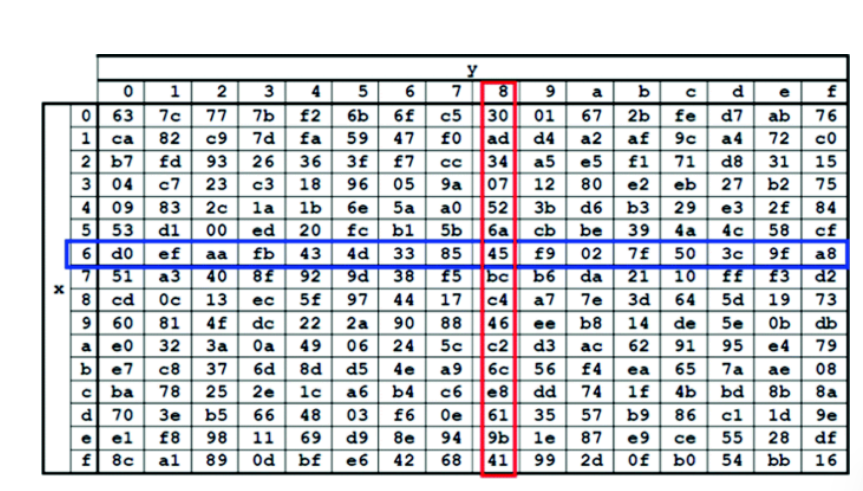

Dando como resultado la matriz

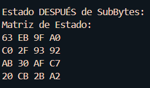

##### Paso 11: ShiftRows

En este paso consiste en realizar un intercambio de columnas de la forma:

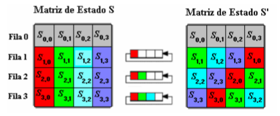

Dando como resultado la matriz:

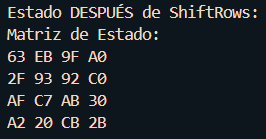

##### Paso 12: MixColumns

En este paso se realiza una transformacion apoyada por la matemática del campo de Galois, descrito mejor en esta [página.](https://www.kavaliro.com/wp-content/uploads/2014/03/AES.pdf)

Este paso da como resultado la matriz

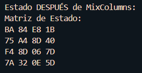

##### Paso 13: AddRoundKey

Este es el último paso de las rondas que se repiten 9 veces. Acá Se realiza la misma operación que al inicio, haciendo que la nueva matriz sea
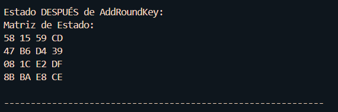

Las líneas punteadas indican que se ha terminado una ronda.

Se repiten los pasos 10 al 13 durante 9 rondas. La última ronda difiere en que no realiza el paso de MixColumns, haciendo que la última matriz sea:

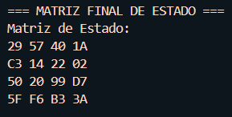

Y como último mensaje muestra la cadena final:

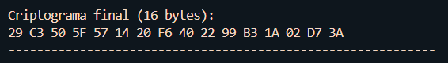
